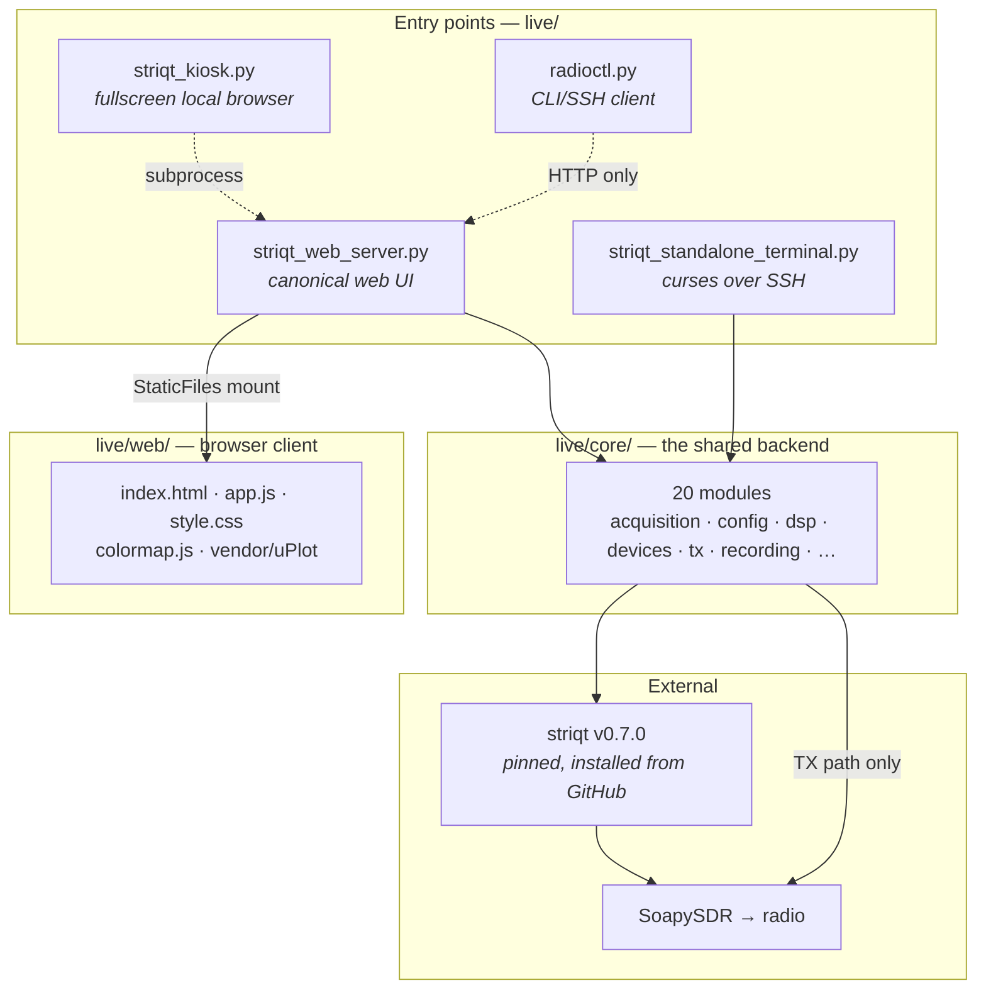
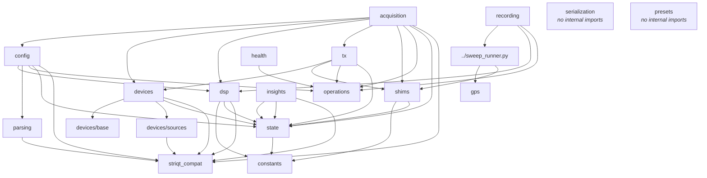
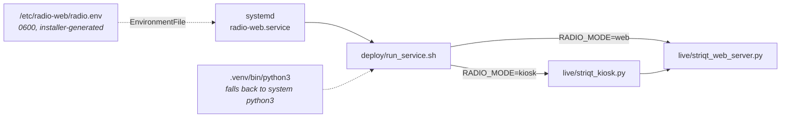
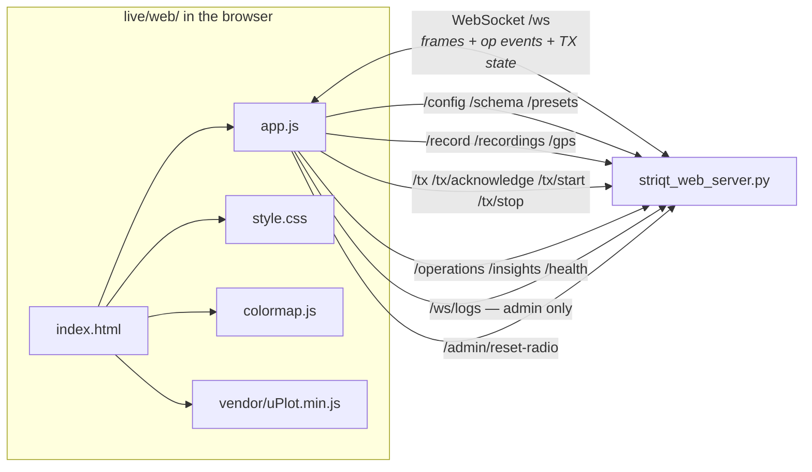
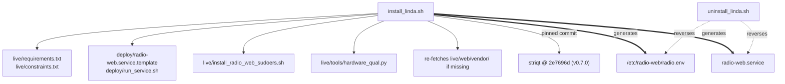

# FILE_MAP.md — how LINDA's files connect

A map of what calls what. Every edge below was derived from the source (Python
imports parsed with `ast`, shell/HTML references grepped), not from memory.

The one architectural rule everything else follows:

> **`live/core/` owns all radio, DSP, and config logic. The scripts in `live/`
> are thin frontends over it.** A bug fixed in a frontend is a bug fixed once;
> a bug fixed in `core/` is a bug fixed for every frontend. Never do the former.

---

## 1. The layers

**Two entry points do not import `core` at all**, which is deliberate and easy
to get wrong:

- **`striqt_kiosk.py`** launches `striqt_web_server.py` as a *subprocess* and
  opens a fullscreen browser at it. It imports only stdlib. The kiosk **is**
  the standalone.
- **`radioctl.py`** is a pure stdlib HTTP client (`urllib`). It talks to a
  **running** server over `/config`, `/health`, `/operations`, `/tx/*`. It
  never opens a radio, which is why it works over SSH against a live service.

The TX path is the one place `core` reaches past striqt to the raw SoapySDR
device API — striqt does not transmit.

---

## 2. Inside `live/core/`

Arrows point from importer to imported. `striqt_compat` is at the bottom
because everything ultimately rests on it.

`serialization` and `presets` import nothing from `core` — they are pure leaves
that the web server calls directly.

### Load order is a correctness constraint, not a style choice

`core/__init__.py` imports `striqt_compat` **first**, before anything else,
and every other module reaches it through that. Two things depend on this:

1. On the AIR-T's pixi environment it re-execs the process once to fix
   `LD_LIBRARY_PATH` *before* scipy/striqt load.
2. It applies the SoapySDR compatibility patches that every non-Deepwave radio
   needs (striqt 0.7.0 was only ever exercised against Deepwave hardware).

`import core` is what guarantees the ordering. Do not lazy-load or reorder it.

### What each module owns

| Module | Owns |
|---|---|
| `striqt_compat` | Defensive striqt imports, AIR-T re-exec, SoapySDR patches. **Loads first.** |
| `constants` | Device profiles, rate/nfft grids, defaults. Data only, imports nothing internal. |
| `state` | Runtime device/channels/backend/fps. Set once at startup, read everywhere. |
| `config` | `RadioConfig` + `SharedConfig`; the three-tier clamp/snap/probe/backstop validation |
| `parsing` | Freedom-model parsers, `ANALYSIS_TARGETS`, striqt scratch validators |
| `dsp` | quicklook/calibrated/psd/ssb backends, `aligned_nfft`, `build_header`, AHAWI geometry |
| `devices/` | Adapter layer — `resolve_device`, channel/rate/clock probing, readback expectations |
| `acquisition` | `Acquirer` (ring + rearm + readback), `Computer`, `DemoAcquirer` |
| `operations` | The `OPERATIONS` audit log: every radio-affecting change and its verdict |
| `tx` | Transmit controller, written against raw SoapySDR (striqt does not transmit) |
| `recording` | Record tab → sweep handoff |
| `gps` | stdlib gpsd client; position fields embedded in recordings |
| `health` | `BOOT_ID` (restart proof), `health_snapshot()` |
| `serialization` | `serialize_frame` / `parse_frame` — the wire format |
| `insights` | Derived read-only summaries for the UI |
| `presets` | Saved capture configurations |
| `shims` | striqt version-compat helpers, `finite_capture_mode`, envelope queries |

---

## 3. Runtime chain — how a deployed radio starts

`deploy/radio-web.service.template` is rendered by the installer
(`@REPO_ROOT@`, `@RADIO_MODE@`, `@SERVICE_HOME@` substituted) and its
`ExecStart` points at `deploy/run_service.sh`, which picks the frontend from
`RADIO_MODE`. **Both `deploy/` files are read by `install_linda.sh` at absolute
paths — remove either and installation fails outright**, it does not degrade.

`live/run_web.sh` is the manual equivalent for development: same interpreter
resolution, plus an optional `cloudflared` tunnel.

---

## 4. Browser ↔ server

The server mounts `live/web/` at `/` via `StaticFiles`
(`striqt_web_server.py:2041`), so the client is served from the same process
that owns the radio.

**`live/web/vendor/` is the offline guarantee.** `index.html:495-498` falls back
to a jsdelivr CDN if the vendored uPlot is missing — so deleting it produces no
error, just plots that never render on a radio in hotspot or ethernet mode,
where there is no internet. The vendored copy is load-bearing precisely because
its absence is silent.

---

## 5. Installed and generated files

`install_radio_web_sudoers.sh` installs the single scoped `NOPASSWD` rule that
makes **Reset Radio** work; without it `POST /admin/reset-radio` fails its
preflight and says so.

---

## 6. Workstation-side tools

These run on **your machine**, never on the radio:

| Tool | Path in | Notes |
|---|---|---|
| `live/tools/fetch_recordings.sh` | rsync over SSH | The default. Incremental, resumable, no size limit. |
| `live/tools/pull_recordings.py` | authenticated `/recordings` HTTP | Use when SSH can't reach the radio but the tunnel URL can. Stdlib only. |

Both are one-way, never delete, and skip `*.partial.zarr.zip` — the server
renames a recording to its final name only after validating it, so a skipped
partial is a recording still being written.

`live/tools/hardware_qual.py` is the exception: it runs **on the radio host**
and imports `core` directly for real-readback qualification.

---

## 7. Non-obvious edges — docs cited from code

Several comments in shipping code cite documents by identifier. These are real
dependencies: delete the document and the comment becomes a pointer to nothing.

| Document | Cited by | Identifiers |
|---|---|---|
| `INSTALLED_STRIQT_API.txt` | `core/shims.py` (4×), `core/acquisition.py` (3×) | Named in **runtime error strings** — a user hitting a striqt API mismatch is told to read it |
| `docs/AUDIT_REPORT.md` | `core/dsp.py:646` by name; `LV-*` tags in `acquisition.py`, `config.py`, `constants.py`, `dsp.py` | `LV-W2`, `LV-R5`, `LV-F1/F2/F8`, `LV-R9b`, … |
| `docs/bug_report.md` | `core/constants.py:122` by name | `P-1` — why the AD936x reference is *not* the AIR-T's 125 MHz |
| `docs/FIXLOG.md` | `config.py:133`, `config.py:1196`, `dsp.py:707`, `dsp.py:1213` | `P1-2`, `P1-5` (sole definition) |

> **Known gap:** `P3-1` … `P3-5` appear in ~26 comments across `acquisition.py`,
> `config.py`, `constants.py`, `dsp.py`, `shims.py`, and `striqt_web_server.py`
> but are **defined nowhere** in the repository or its history. They are already
> dangling; no document restores them.

---

## 8. Deliberately unconnected

Not everything in the tree is on a live edge, and two of them are that way on
purpose:

| Path | Status |
|---|---|
| `live/legacy/` | **Frozen.** Four pre-`core` scripts, each with a duplicated backend. Nothing imports or launches them. Kept because `core/shims.py`, `core/acquisition.py`, and `core/devices/sources.py` cite them for provenance. Fix bugs in `core/`, never here. |
| `live/web_sim/index.html` | Self-contained browser **simulation** with synthetic IQ and inline CSS/JS. Not served, not mounted, not opened by any script. A standalone demo — it will drift from `app.js` by design, so do not treat it as a second client to keep in sync. |
| `live/tests/` | 21 files. Imports `core` heavily; imports no frontend. Runs with no hardware and no striqt, and also runs *on* the radio host. |
